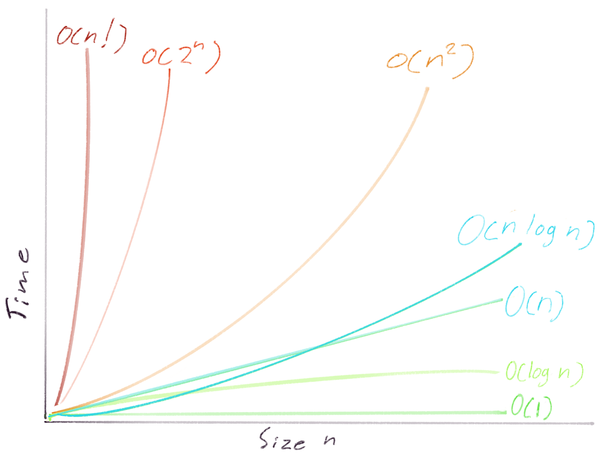

import { A, P } from "../../components/Typography";

### What Is Big-O Notation?

It's a way to express the efficiency of an algorithm. There are more formal definitions in the context of computer science and math. But this is a fair, intro-level definition for coding problems. Big-O allows programmers to describe the efficiency of their code in a few characters.

### Why Is It Important?

Depending on what type of development you do, Big-O may rarely or never come up in your day-to-day. Still, many companies ask applicants to do coding challenges and Big-O may come up then.

I won't make a general comment on whether this is good hiring practice. Some believe it is, some believe it isn't. If it's standing between you and the job you want, it's important. The purpose here is to help you understand it and not stress about it.

Many explanations of Big-O are more formal than we need. They assume a math or computer science background. Maybe you've seen them before and been dissuaded. We're going to explain Big-O for software developers who write code.

### What Does 'O' Stand For?

Order of complexity. We need to pause and explain what complexity means in this sense. Usually, we think of complex code as hard to understand code. That's not what complexity means here. In Big-O, complexity means how expensive or costly the algorithm is.

Complexity can refer to the cost of different things.

- **Time complexity** – how long an algorithm takes to run.
- **Space complexity** – how much memory is needed for an algorithm to run.

For the rest of this article, we will only talk about **time complexity** since it is usually the concern for our coding challenge problems.

## From Code To Big-O

As developers, we want to look at a piece of code and find its Big-O. Let's go through that process with this function.

```javascript
function findPapersWithString(papers, str)
  const results = []
  for (let paper of papers) {
    if(paper.contains(str)) {
      results.push(paper)
    }
  }
  return results
}
```

Let's describe the work it does in human-speak. Then reduce it bit by bit till we get Big-O notation. In English, we could describe the work of this code as..

> The time it takes to do paper.contains() multiplied by the number of papers.

It gets the idea across but it's clunky. Let's replace the phrasing with named variables and a multiplied-by symbol.

> time_to_do_contains \* number_of_papers

Much better. Let's keep reducing. We'll replace number_of_papers with something general – n. N will represent the size of the input. It could be number_of_papers, numbers_in_sequence, items_in_an_array, etc.. It's a general term for how much data the algorithm will process.

> time_to_do_contains \* n

What to do with the time_to_do_contains variable? It's specific to our algorithm so it needs to go. Again, let's replace it with something general.

> operation_time \* n

For any algorithm, there will be an operation happening alongside the data. Big-O implies operation_time so we can omit it. Now we have a very simple expression.

> n

Wrap it in O() and we have our Big-O notation.

> _O(n)_

In conversation, you could say this a few ways. That algorithm runs in n time. This solution is n. That solution is Big-O of n. It has a runtime of n. Different ways to say the same thing.

Nice, we've analyzed our first piece of code and found the Big-O.

## Runtimes

We can call these Big-O notations runtimes. _O(n)_ is a runtime. It is a very common runtime because it emerges whenever we loop through all items in an array. Finding the smallest or largest item in an unsorted array is _O(n)_. Processing each item in an array (map) is _O(n)._ Summing and averaging arrays (reduce) are also _O(n)_ runtime.

_O(n)_ is also referred to as linear time. The runtime scales one to one (linearly) to the data size.

There are some other common runtimes out there that are worth knowing. Once we have familiarity with them, finding Big-O becomes more of a multiple-choice problem. We can look for patterns rather than analyzing code from scratch.

We've already reviewed _O(n)._ Now we'll review some others.

### N Squared Time

Let's find the Big-O notation for this function.

```javascript
function createMultiplactionTable(arr) {
  const results = [];

  for (let i = 0; i < arr.length; i++) {
    for (let j = 0; j < arr.length; j++) {
      results.push(arr[i] * arr[j]);
    }
  }
  return results;
}
```

We can describe the runtime in English as:

> The time it takes to multiply each item in an array by each item in the array.

We'll reduce the English phrasing to variables and symbols.

> time_to_do_multiplication \* array_size \* array_size

Let's use n for the data size variable as we did before.

> time_to_do_multiplication \* n \* n

Now replace the specific time_to_do_multiplication with the general operation_time.

> operation_time \* n \* n

Then omit operation time because it's implied in Big-O.

> n \* n

We can rewrite a number multiplied by itself as that number squared. And with that we're at Big-O notation:

> _O(n^2)_

In conversation, you could say this a few ways. That's an n squared runtime. That's a quadratic algorithm. This solution is n squared.

The dead giveaway of _O(n^2)_ is the nested for loop or the "_i j"_ loop. It's a slow runtime. It doesn't scale well when n gets large. Many _O(n^2)_ runtimes are naive solutions for problems that could be solved more efficiently.

Next let's look at a runtime that's really efficient.

### Logarithmic Time

Big-O for logarithmic time is written like this:

> _O(log n)_

_O(log n)_ is faster than _O(n)_. That may seem weird at first to think that something can be faster than _O(log n)_. But if we visualize an example it's clearly possible and it's very important.

In the game 20 questions, one person in a group thinks of something. It could be absolutely anything. Any person, place, or thing. The group can only ask 20 yes or no questions to find the exact thing the person is thinking.

Without a logarithmic way to drill down the data set, it would be almost impossible for the guessers to win. If the "asking questions algorithm" was _O(n)_ you would have a 20 in n chance, where n is all the data in the person's brain. But if you ask good questions it is like _O(log n)_. Then it's pretty easy to win.

Are you thinking of a person? Yes. Is the person fictional? No. Is the person alive? Yes. Is the person famous? Yes. With those four questions, the data set went from the person's entire brain, down to 5,000ish possible famous, living, non-fictional people, they'd be able to think of. That ability to quickly narrow down a brain-full of information has huge implications.

The best questions will roughly cut the data set in half. In code you can always cut the data set in half. Then repeat until you get to a single item.

Here's the 20 questions game in code, except it's really boring because it's sorted numbers instead of a person's brain. But it's very efficient.

```javascript
function findK(sortedArr, k)
  while(sortedArr.length > 1) {

    // divide array in half
    const halfway = Math.ceil(sortedArr.length / 2)
    const firstHalf = sortedArr.slice(0, halfway)
    const secondHalf = sortedArr.slice(halfway)

    // check if k could be in first or second half
    if (!sortedArr[0] || sortedArr[0] > k) {
    sortedArr = firstHalf
    } else {
      sortedArr = secondHalf
    }

    // return k if we find it
    if(sortedArr.length === 1 && sortedArr[0] === k) {
      return sortedArr[0]
    }
  }

  // k not in array
  return null
}
```

It only takes 20 times through this loop to find K from an array of a million. 30 times through and we could find K in a billion. That is very efficient.

When thinking of _O(log n)_ think of binary search. Think of cutting a data set in half like the 20 questions game.

_O(log n)_ is the inverse of _O(n^2)_. In _O(log n)_ time the data set could be enormous and the algorithm can still run in a reasonable time. In _O(n^2)_, the running time becomes unmanageable when the data set becomes large.

### O(n log n) Time

This is the most complicated runtime we'll cover. It is a combined _O(n)_ and _O(log n)._

> _O(n)_ \* _O(log n)_ = _O(n log n)_

For each `n` we need do an operation that is `log n`. As far as efficiency goes, this is faster than _O(n^2)_ but slower than _O(n)_.

This runtime is seen in sorting algorithms like Quicksort and Mergesort.

Let's analyze Mergesort and see why it's _O(n log n)_

```javascript
function mergeSort(arr) {
  // base case done splitting if one item O(1)
  if (arr.length <= 1) return arr;

  // divide O(1)
  const middle = Math.floor(arr.length / 2);
  const left = arr.slice(0, middle);
  const right = arr.slice(middle);

  // recurisve divide is O(log n)
  return merge(mergeSort(left), mergeSort(right));
}

// Merge is O(n)
function merge(left, right) {
  const sorted = [];
  let leftIndex = 0;
  let rightIndex = 0;

  // comparison sort left and right
  while (leftIndex < left.length && rightIndex < right.length) {
    if (left[leftIndex] < right[rightIndex]) {
      sorted.push(left[leftIndex]);
      leftIndex++;
    } else {
      sorted.push(right[rightIndex]);
      rightIndex++;
    }
  }

  // push remaining
  while (leftIndex < left.length) {
    sorted.push(left[leftIndex]);
    leftIndex++;
  }
  while (rightIndex < right.length) {
    sorted.push(right[rightIndex]);
    rightIndex++;
  }

  return sorted;
}
```

Disclaimer – We're going to stick to a simplified explanation here. There are [algebraic](https://www.youtube.com/watch?v=LPfHV3xWwXg) ways to prove this is _O(n log n)._ There are also [recursion tree drawings](https://courses.csail.mit.edu/6.006/spring11/rec/rec08.pdf) to help visualize and prove it. Those are too in-depth for this article.

Divide and conquer is a useful simplification for this level of overview. Divide (split) is _O(log n)_. Conquer (merge) is _O(n)_. Not all divide and conquer algorithms are _O(n log n)_ but when the conquer step is _O(n)_ you can be pretty sure the whole algorithm is _O(n log n)._

### Exponential & Factorial Time

We won't cover these in-depth but just plot them on our landscape of common runtimes. These are the most inefficient runtimes of all. Exponential is the second-worst and factorial is the worst. When n gets sufficiently large these will take thousands or millions of years to complete with today's computers. There are problems whose only general solutions are factorial or exponential. The [traveling salesman problem](https://en.wikipedia.org/wiki/Travelling_salesman_problem) is the most famous one.

**Exponential**

> O(2^n)

**Factorial**

> O(n!)

### Constant

We're wrapping up with an easy one. Constant time is written as _O(1)_. With constant time it doesn't matter how big the input is. It will always take the same amount of time. Here are some examples:

```javascript
const firstItem = myHugeArray[0]; // O(1)
const len = myHugeArray.length; // O(1)
```

## Recap

From most to least efficient, here are the Big-O runtimes.

- O(1) – Constant – Get first item from array
- O(log n) – Logarithmic – Binary search, 20 questions game analogy
- O(n) – Linear – Process each item in array, sum, average
- O(n log n) – Mergesort, Quicksort, many Divide and Conquer algorithms
- O(n^2) – Quadratic – Nested loops
- O(2^n) – Exponential – Find Fibonacci sequence without caching (not covered)
- O(n!) – Factorial – Traveling Salesman Problem (not covered)


