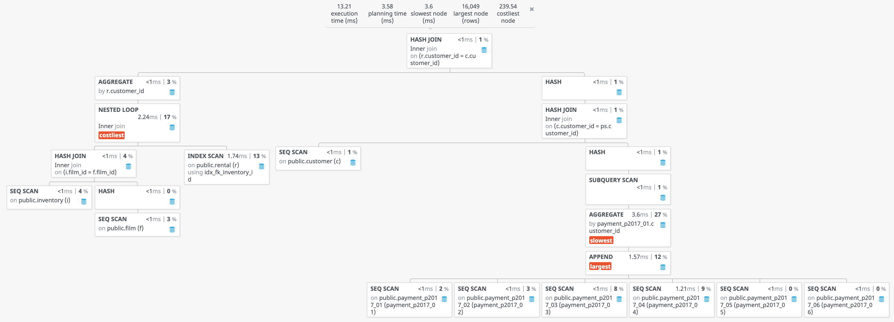
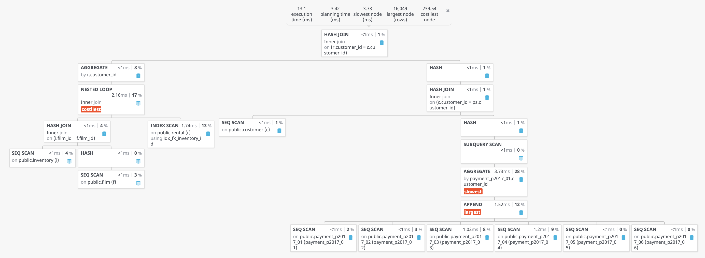

SQL provides a construct called a CTE (Common Table Expression). With CTEs you can write a query and give it an alias which can be joined. I like to think of CTEs like inline-views.

CTEs can eliminate subqueries from a single `SELECT` turning them into simpler joins. Should you rewrite subqueries into CTEs? Will it impact performance? Let's find out.

The examples will come from the classic [Sakila database](https://dev.mysql.com/doc/sakila/en/). In this case I am using PostgreSQL so it is technically the [Pagila database](https://github.com/devrimgunduz/pagila). Use either of those to follow along.

## Requirements

The rental store owner wants a view in a dashboard that shows:

- All customers who've rented a movie shorter than an hour
- Their lifetime value (sum of all their payments)

### Subquery Version

```sql
SELECT
    c.customer_id
    , ps.amount
FROM
    customer c
    JOIN (
        SELECT
            customer_id
            , SUM(amount) AS amount
        FROM
            payment
        GROUP BY customer_id
    ) ps ON c.customer_id = ps.customer_id
WHERE
    EXISTS (
        SELECT 1
        FROM
            rental r
            JOIN inventory i ON r.inventory_id = i.inventory_id
            JOIN film f ON i.film_id = f.film_id
        WHERE
            r.customer_id = c.customer_id
            AND f.length < 60
    )
```

### CTEs Version

```sql
WITH payment_sum AS (
    SELECT
        customer_id
        , SUM(amount) AS amount
    FROM
        payment
    GROUP BY customer_id
)
, movie_rentals_under_an_hour AS (
    SELECT
        r.customer_id
    FROM
        rental r
        JOIN inventory i ON r.inventory_id = i.inventory_id
        JOIN film f ON i.film_id = f.film_id
    WHERE
        f.length < 60
    GROUP BY r.customer_id
)
SELECT
    c.customer_id
    , ps.amount
FROM
    customer c
    JOIN movie_rentals_under_an_hour r ON c.customer_id = r.customer_id
    JOIN payment_sum ps ON c.customer_id = ps.customer_id
```

Both of these queries produce the correct results for the requirements. Note we are just returning the minimum data for brevity. No firstname, lastname or other display data.

## Styles

Stylistically I prefer the CTE version for a few reasons.

### Explicit Naming of Concepts

In the CTE version, each requirement is broken out and given a name. The requirements are not strewn out, unlabeled in the whole query.

Rentals under one hour is a conceptual section.

The subquery version could use a comment to label the JOIN and the subquery that apply to each requirement. But I find that comments are more likely go to stale than a CTE would be.

Naming things is hard but not naming things is worse.

### Hints For Re-use

It's a sad state when duplicate business logic is littered across stored procedures and queries. It's a huge liability for bugs.

Less than hour long rentals could be a domain concept that applies to other features. Maybe a view is warrented to avoid logic duplication, maybe not. It's a judgement call and I would not advocate for premature abstraction. However, the existence of the CTE with a defined responsibility can help show when it's time for re-use.

### Readability

We've got two simple requirements in our example. It's reasonable to understand what's going on by taking in the whole thing. But what if there was more to it? What if there were 4 subqueries and 3 pretty complex JOINs? It can become difficult to grok.

The CTE version starts to shine the more complicated things get. The complexity of each statement and indentation can be capped.

## Performance

You can't speculate on performance. You have to measure.

I used PostgreSQL's `Explain` to get some capture the actual cost of these queries. I've captured the two plans and put them in a graphical viewer. (Click or tap to see the images in full screen and zoom.)

### Subqueries Plan



### CTEs Plan



These plans are nearly identical. You should be able write a subquery as a CTE and get pretty much the same plan, with small differences.

But, as always with performance, you have to measure. That is the only way to know for sure if it's the same, better, or worse. And when you measure, look at the cost not the duration.

I tend to spot performance improvements more easily in CTEs, such as adding a missing SARG-able parameter. I attribute this to CTEs being broken down into smaller pieces.

What cannot be concluded is CTEs will perform better than subqueries or vice versa.

## Is It Just Preference?

The benefits of CTEs are in improving readability and maintainability. Is readability in the eye of the beholder? It's somewhere between objective and subjective. You could certainly write unreadable code with CTEs or with subqueries.

### My Conclusion

When I write with CTEs, I find I'm forced to be more considerate, to give names and intent to things. Names and intent improve prose. That definitely has value.

I'm going to use and advocate for CTEs over multiple, large subqueries.

<hr />

## Resources

- [PostgreSQL Explain Viewer](http://tatiyants.com/pev/) by [Alex Tatiyants](http://tatiyants.com/)
- [CTE Plan JSON](/resources/analyze-cte.json)
- [Subquery Plan JSON](/resources/analyze-sub.json)

### Use PostgreSQL Explain To Measure

```sql
EXPLAIN (ANALYZE, COSTS, VERBOSE, BUFFERS, FORMAT JSON)
SELECT * FROM -- ...
```
