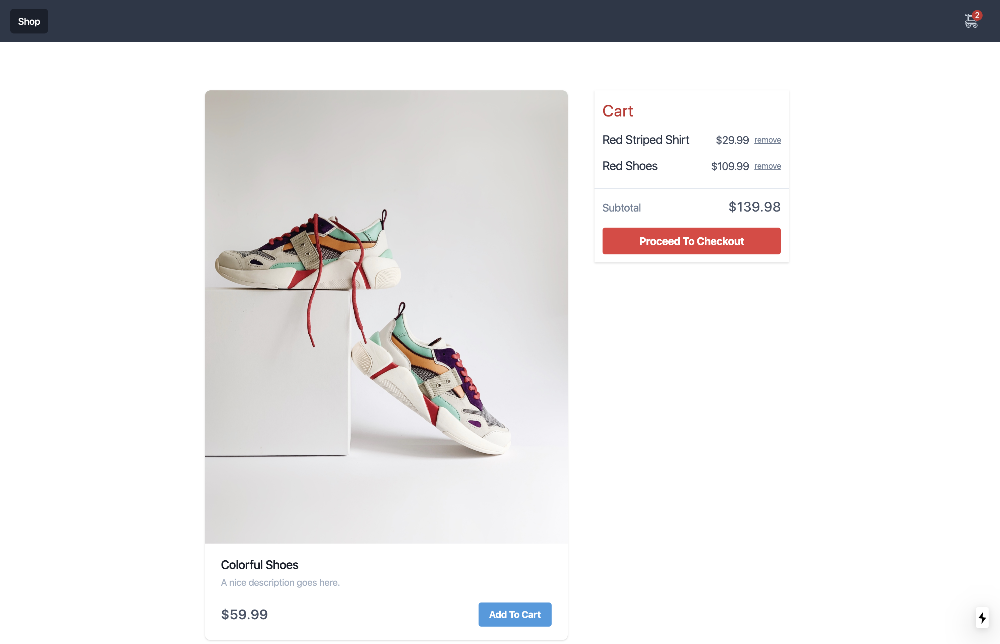

import { A } from "../../components/Typography";

TL;DR

React Hooks + Context is a viable pattern for Global State. It cuts the boilerplate and cruft that Redux introduces. Play around with <A href="https://github.com/franklintarter/react-hooks-context-example/" target="_blank">the repo</A> to see a bare-bones example of the pattern.

## No Redux, Just Hooks and Context

Applications have state. In React applications, Redux has been the de facto choice for app state. Here's my complaint about Redux – the Redux-y stuff leaks into the app code. Here's what I mean:

```javascript
import { connect } from "react-redux";
import { increment, decrement, reset } from "./actionCreators";

// const Counter = ...

const mapStateToProps = (state /*, ownProps*/) => {
  return {
    counter: state.counter,
  };
};

const mapDispatchToProps = { increment, decrement, reset };

export default connect(mapStateToProps, mapDispatchToProps)(Counter);
```

That's a lot of Redux jargon in our component. We see action creators, map dispatch and map state to props. We can cut the jargon with React Hooks + Context. The above example would look like this:

```javascript
import React, { useContext } from "react";
import { CounterContext } from "../context/CounterContext";

export default () => {
  const { increment, decrement, reset, counter } = useContext(CounterContext);
  return <> /* ... pass props to other components ... */ </>;
};
```

The jargon is gone. Now we can pass the state and actions down to components as props. We'll still have decoupled React components that are only concerned with the view.

### What We'll Build

We'll create a basic shopping cart experience where we can shop available products, add and remove items from our cart. We'll use NextJs as our React bootstrapper. The end result will look like this:



Note: we won't cover all the styling or even the layout here. We're going to focus on using context to manage the cart state and actions. To see how everything works together clone <A href="https://github.com/franklintarter/react-hooks-context-example/" target="_blank">the repo</A> and start playing with it and extending it.

If you want to build this demo from scratch, initialize a Next app.

```shell
npm init next-app
# or
yarn create next-app
```

## useContext, useState

We need do three things to use the global context pattern:

1. Write Our Context
2. Provide the Context to the App
3. Use Context in Pages/Components

### Write Our Context

Our context does the following

- Manage the cart items state
- Expose actions to add and remove cart items

Here is the entire shopping cart context.

```javascript
// context/cart-context.js
import React, { useState, createContext } from "react";

const CartContext = createContext();

// From CMS/API
const products = [
  {
    sku: "SHIRT-1",
    name: "Red Striped Shirt",
    price: 29.99,
    image: "/mrushad-khombhadia-GlgDs6_WhTg-unsplash.jpg",
  },
  {
    sku: "SHOES-1",
    name: "Colorful Shoes",
    price: 59.99,
    image: "/irene-kredenets-dwKiHoqqxk8-unsplash.jpg",
  },
  {
    sku: "SHOES-2",
    name: "Red Shoes",
    price: 109.99,
    image: "/paul-gaudriault-a-QH9MAAVNI-unsplash.jpg",
  },
];

const CartProvider = ({ children }) => {
  const [cartItems, setCartItems] = useState([]);

  const addToCart = (sku) => {
    const itemToAdd = products.find((item) => item.sku === sku);
    const nextCartItems = [itemToAdd, ...cartItems];
    setCartItems(nextCartItems);
  };

  const removeFromCart = (sku) => {
    const nextCartItems = cartItems.filter((item) => item.sku !== sku);
    setCartItems(nextCartItems);
  };

  // Public API of the Context
  const value = { products, cartItems, addToCart, removeFromCart };

  return <CartContext.Provider value={value}>{children}</CartContext.Provider>;
};

export { CartContext, CartProvider };
```

We're also hard coding some products here to keep things simple. In a real example, these would come from a CMS or API.

Note that the `value` is the public API of our context. Everything we return from `value` can be used by components through the CartContext.

### Provide the Context to the App

There's one boilerplate chore to make the context available to the whole application. Since we're using NextJs, we use `pages/_app.js` as the global entry point.

```javascript
// pages/_app.js
import React from "react";
import { CartProvider } from "../context/cart-context";

export default ({ Component, pageProps }) => {
  return (
    <CartProvider>
      <Component {...pageProps} />
    </CartProvider>
  );
};
```

This will look different if you're not using NextJs. In GatsbyJs we'd do something like this in both the `gatsby-browser.js` and the `gatsby-ssr.js` files. But it's all the same purpose, wrapping the whole React App with a Context Provider.

### Use Context in Pages/Components

Now we get to enjoy using the context to create the shopping experience.

```javascript
// pages/index.js or components/MyComponent.js
import React, { useContext } from "react";
import { CartContext } from "../context/cart-context";

export default () => {
  const { cartItems, addToCart, cartItems } = useContext(CartContext);
  return <> ... </>;
};
```

We can access anything we returned as a "value" from the CartContext.

## Better Than Redux?

Opinion time: It's better. Why?

CartContext exposed nothing redux-y or state management-y to the outside world. You don't see any jargon terms like map dispatch, map state or connect anywhere in the consuming code. This is encapsulation.

You put in a little faith in the magic of `useContext`. Then use standard JavaScript to destructure what you need out of your own context API. It's high signal low noise. It's terse and expressive. I place a lot of value in those things in code.

## Creating and Styling Components

I won't copy/paste all the page, component, assets and layout code here. You can check them out in <A href="https://github.com/franklintarter/react-hooks-context-example/" target="_blank">the repo on Github</A>. It uses default TailwindCSS to avoid writing media queries and CSS for a barebones demo.

## Next Steps

Try adding functionality to the CartContext. Try writing a discount system with context, or the ability to do quantities of the same product.
